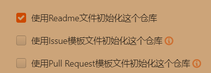
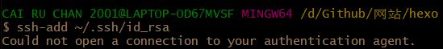
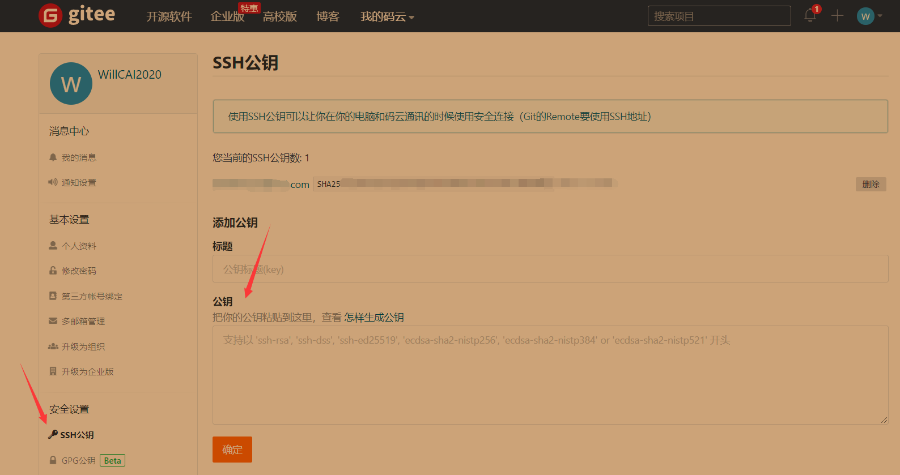
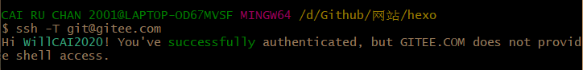
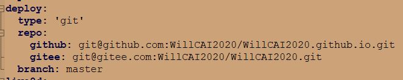
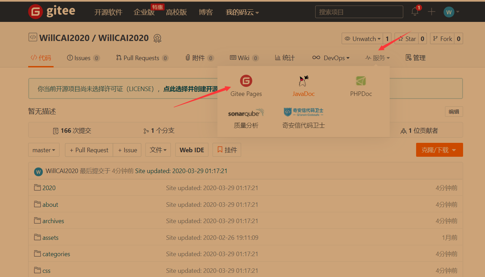
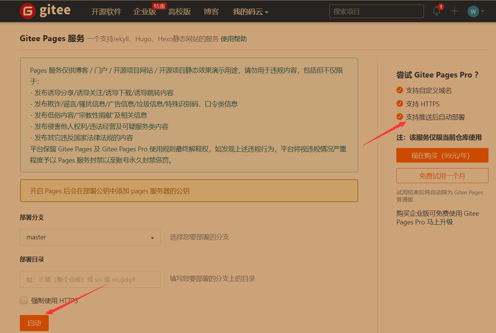
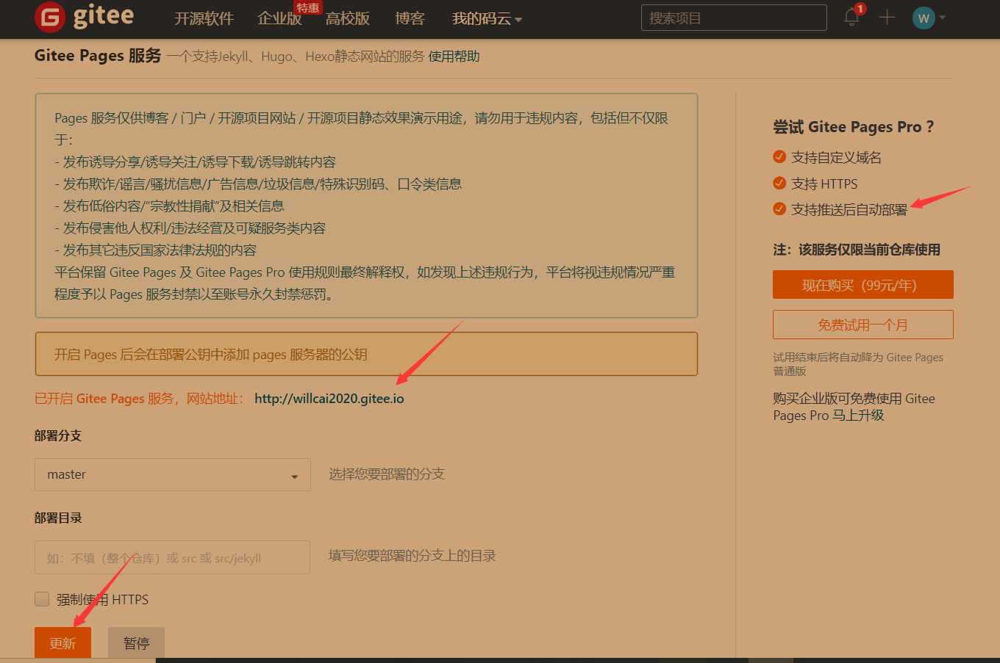
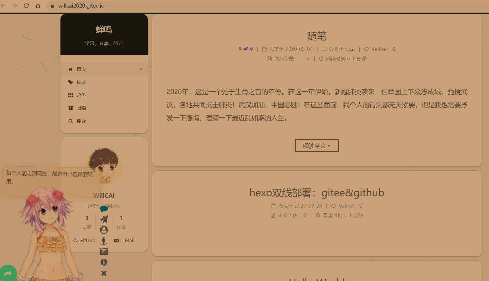
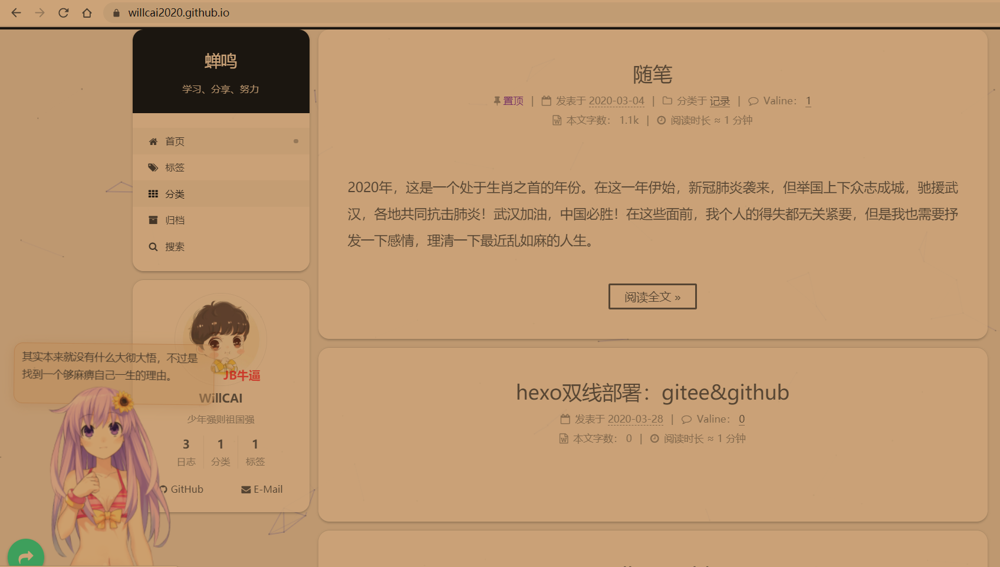

每次加载我的hexo博客总是打开的很慢，大多时候需要反复刷新才可打开、甚至打不开。因此上网搜寻原因，结果大多言说hexo部署到的GitHub是国外的网站，国内访问速度很慢，解决方法无非是将博客部署到国内，比如Coding、Gitee。我尝试了Gitee。经过查阅诸多大佬的教学，最终总结出一条部署到Gitee的可行之法！

<!-- more -->

**这算是我用hexo写的第一篇笔记，也可称为教学（因为随时间流逝，任何一种方法能否实现都具有不确定性，这在尝试的道路上可深刻体验！）**

> 得益于Hexo, jekyll这类轻量静态博客框架的流行与各大代码托管平台提供的Pages服务。如今，建立个人博客的门槛已经极大的降低。然而，托管于Github上的静态Blog在国内拥有原生的缺陷，即访问速度的缓慢。此时将Hexo Blog同步托管到Github与支持Pages服务的国内代码托管平台，例如码云(Gitee)、Coding，不失为一种有效的解决方法。
>
>                                                                                                                                                    ---摘抄自一教学

# Gitee

## 注册账号

Gitee亦称作**码云**，它亦服从git命令，我看到它的第一感觉就是中国版的github。

注册自然不必多说，从[Gitee官网](https://gitee.com/)注册即可。

> 同样可选择Coding,不过需要实名认证，不介意可[参照这篇教学](https://help.coding.net/docs/devops/cd/static-website.html)

注册需绑定手机号，如此才可开启Gitee Pages 服务。

# 创建仓库（项目）

我个人认为hexo部署到github以及gitee步骤没太大区别。

在这一步，**gitee创建的仓库要求最好仓库名和用户名相同**，否则你的Pages首页访问地址会带二级目录。举个栗子：你若仓库名和用户名相同，那么你后面开启的Gitee Pages访问网址是yourname.gitee.io形式,而不是yourname.gitee.io/my_blog形式。（听说若带二级目录，会有：当要部署的项目与自己的个性地址不一致时，部署完成后存在一些资源访问404？具体情况请[参考这里](https://gitee.com/help/articles/4136#article-header1)）

记得github这一步也是个注意点，github的仓库名一定要是形如**username.github.io的形式**，否则会直接导致后面部署失败！

**还有要注意，创建仓库是要选择'公开'以及'使用Readme文件初始化这个仓库'！**（刚开始我没选择这两个，导致后面找不到Gitee Pages...）




最后点击创建即可。

# 将SSH密钥到Gitee

hexo部署好像是有两种方法，使用SSH或者GTTPS，之前我参照部署到github的教程是采用的SSH的方法，所以我这一步是选用SSH密钥。

这里也copy一下生成密钥的方法啦：

## 前提

前提是你肯定要已经安装好了git，安装git教程网上都有的，差别不会太大，但要记得要下到最新版本的来（最好去[Git官网](https://git-scm.com/)），有些教程给你提供的安装包是很老很老的版本的，我之前部署到github就因为这个出错，作为小白的我找了大半天，最后开始学会看git命令的运行过程才找出错误...

安装git后，鼠标点击右键，可以看到这样：

git bash here表示在当前目录下运行git bash（**在不同的目录下运行效果不一样，切记！**）

进入你为hexo博客所有相关文件存入的文件夹中，然后通过git bash here打开打开git bash。

## 获取SSH

打开git bash，输入`ssh-keygen -t rsa`接着**按照提示进行操作**(回车三下)，如下所示说明创建公私钥成功，回车默认是把公钥和私钥保存在默认的路径(我们可以选择自己的路径，把路径输入即可，但是不建议这么做，否则后面会出bug):


接着运行下面的两条命令：

```javascript
ssh-keygen -t rsa -b 4096 -C "your_email@example.com"		
ssh-add ~/.ssh/id_rsa
```




这样就会在C盘用户目录下生成id_rsa和id_rsa.pub这两个文件，前者是私钥，后者是公钥。

在C盘用户里找到.ssh文件夹，用记事本打开id_rsa.pub，复制其中的全部内容，添加到Gittee(或Github)上，这样本地的id_rsa密钥就可以和Gittee(或Github)上的id_rsa.pub公钥进行配对，授权成功。


## 添加SSH

点击右上角的头像打开设置，在安全设置选项中点击SSH公钥，把上述所说的id_rsa.pub中的内容全部复制到框框中，完成授权 ：



SH key添加之后，就可以在本机的git bash下进行测试，输入：`ssh -T git@gitee.com`进行测试，出现HiXXX，说明授权成功：



注意：如果出现无法登陆的情况，先把之前生成的文件懂删了以后再重新生成一下ssh，（建议使用默认目录，否则这个地方会出问题）

# 上传文件到Gitee仓库

这算是最重要的一步，作为小白的我看了那么多教程，在这卡了好久...

根据与Github的相似性，于是采用与部署到Github相同的方法。

## 前提

首先你得拥有个hexo，具体过程现在不想回忆，之后也许会写一篇关于从hexo搭建到部署的历程，这个都是泪啊！

安装hexo后就拥有了hexo对于git命令的三部曲：

`hexo clean` （清理缓存什么的，执行一下没坏处）
        `hexo g` （生成静态文件）
        `hexo d` （部署到github上，如果只是本地预览把这一步换为 hexo s）

 **强调**：两个概念

```
站点配置文件：初始化hexo的那个文件夹下的_config.yml文件；
主题配置文件：theme目录下的每个主题文件夹的_config.yml文件
(每个主题都有一个主题配置文件，但是一个站点只有一个站点配置文件)

打开站点配置文件先打开配置文档_config.yml，对它做如下修改，repository后面的内容是 git@gitbub.com:username/库地址 的形式

注意：type、repository、branch冒号的后面都有一个空格（切记所有配置文件中冒号与值之间都有一个空格）
```

## 修改hexo根目录下的站点配置文件

打开_config.yml（可以用记事本，我用的是Notepad++编辑），修改如下：



发现当我添加了一个部署的仓库后，两者后面（库地址）都应加`.git`。

倘若未配置SSH密钥，则为:

```
deploy:
  type: 'git'
  repo: 
    github: https://github.com/{yakuback}/{yakuback}.github.io.git
    gitee: https://gitee.com/{yakuback}/{yakuback}.git
branch: master
```

## 通过git bash上传文件至仓库

首先通过ssh登录github，即执行指令`ssh -T git@gitee.com` ，在本地预览的时候不需要这一步，接着执行三部曲

 `hexo clean` （清理缓存什么的，执行一下没坏处）
         `hexo g` （生成静态文件）
         `hexo d` （部署到github上，如果只是本地预览把这一步换为 hexo s）

需要时间貌似有点久，运行git其中需要联网的操作，其速度也许是和网速有关emm...

注意：

如果在部署时执行命令`hexo d`时出现：`Error Deployer not found: git`，需要执行下面的步骤：

```
安装hexo-deployer-git:
	 $ npm install hexo-deployer-git --save
重新deploy:
	 $ hexo deploy
```

我记得这个我是在部署到github出错过的，执行这两行代码后部署到gitee是没出错的。

三部曲运行截图：


全部成功后刷新Gitee中的仓库即可。

# 开启Gitee Pages

## 开启Gitee Pages





注意：当你每次更新hexo中的文档并执行三部曲后，倘若你没有到Gitee中更新，那么更改就不会出现在你的Gitee得到的网页中。（看到红色箭头没，人家Gitee自动部署是VIP的待遇，我们平民玩家是木有滴，Github则支持自动部署）

最后：



# 总结

结果就是你的hexo就拥有两个网址了...<无语至极啊！>





最后讲讲效果及真实感受：

古人诚不欺我！：不闻不若闻之,闻之不若见之,见之不若知之,知之不若行之.学至于行止矣.

——《荀子·儒效》

花了这么长时间，终于排除了又一个对我来说的错误答案！

反复试验刷新页面，最终变成比哪个网址最先刷新出文字...

部署到Gitee上没有加快我的博客的访问速度！

白天再试试部署到Coding或者利用gulp等压缩的方法，看看究竟哪个是真正有用的！

写着写着，也到深夜了，这不过是相当于是重温了下所做过的事，重要的不过是从中学习到的方法，比如类比Github部署的方法。

我这个小小博客写的东西，最多认识的朋友赏眼看一下罢了，最终不过是当作一个历程笔记来用而已。

晚安！

