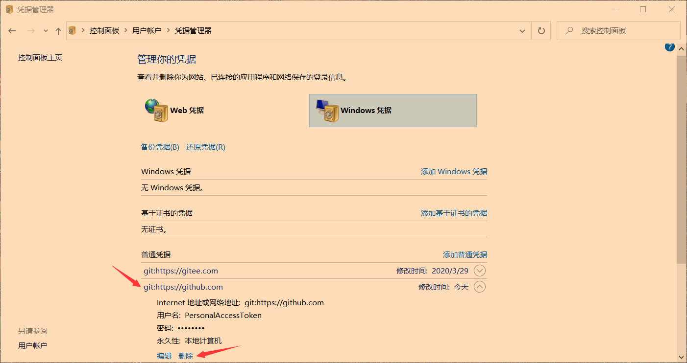

使用 SSH 连接 Github 账号的方法！😎

<!-- more -->

## 前言

使用 Github Page 部署个人博客后便知道，当我们用「用户名.github.io」作为仓库名时，再将 public 文件推至该 Github 仓库，便可得到一个形为「用户名.github.io」的网址。显然，这种仓库名在一个 Github 账号中只能存在一个，故而一个账号只能得到一个这样的网址。😑

<blockquote class="quote">按理一个仓库可部署出一个静态网站，但 「用户名.github.io」已经算是其中最简便最好记的网址。不在意域名长的话，一个 Github 账户自然可得到多个个人博客。</blockquote>

由于我之前花了大量精力鼓弄了一个 Hexo 框架，主题为 Next 的博客，因加入了许多花里胡哨但却并没必要的功能，网站打开速度慢，这也是我转而使用 Hugo 框架的原因 。我既不想放弃魔改已久的博客，又不想网址太丑（绑定个人域名可以避免这点），于是干脆新申请了个 Github 账号用以配合 Hugo 搭建个人博客。🙃

但这时便面临问题，一方面仍执着于鼓弄 Next 主题新功能，另一方面还得向 Hugo 所在的 Github 仓库上传更新文件，而且两个博客都是通过默认的 HTTPS 的方式上传文件，HTTPS 输入账号密码后会默认保存，这就导致电脑登陆 Github 时可能会错位，即可能使用了账号一的密码去登陆账号二。

针对这种情况有一种解决方法：在想切换登陆账号二时，删去已保存的 Github 账号一的用户名和密码，接着再输入账号二的用户名和密码。

删去方法如下：

在以下路径找到 Github 的 Windows 凭据，直接删除即可。



显然这样的操作极为麻烦，倘若能通过 SSH 分别匹配好一个账号，那就能免去每次输入账号密码的麻烦过程了[^1]😎。

先来看看如何使用 SSH：

## 单账号

首先执行下行命令生成 SSH 密钥对：

```javascript
ssh-keygen -t rsa -b 4096 -C "your_email@example.com"
```

将上面的邮箱地址改为你自己在 GitHub 上的[邮箱地址](https://github.com/settings/emails)。如果你是第一次生成的话，一路回车即可（口令 passphrase 非必须）。若遇到需回答「 yes or no ?」，键入 `yes `并回车即可。

这样就会在C盘用户目录下生成`.ssh`文件夹，其中包含了 id_rsa 和 id_rsa.pub 这两个文件，前者是私钥，后者是公钥，用记事本打开 id_rsa.pub，复制其中的全部内容，再去 GitHub 上[设置](https://github.com/settings/keys)一个 New SSH key，标题随意起，最后粘贴公钥即可。这样本地的 id_rsa 密钥就可以和 GitHub上的 id_rsa.pub 公钥进行配对，授权成功。

注：如果你之前通过`git remote add` 添加了 Github 仓库的 HTTPS 地址[^2]，那么需要修改仓库的远程仓库链接地址为 SSH 地址，在..本地仓库文件..中打开 git bash，键入如下命令：

```javascript
git remote set-url origin git@github.com:Nimnahc2020/myblog.git
```

将`git@github.com:Nimnahc2020/myblog.git`换为你仓库的 SSH 地址即可。


此外，当你本地第一次连接 GitHub 的服务器时，可能会有警告信息，键入 `yes` 并回车即可。

## 多账号

同单账号一样，先得到两组密钥对，邮箱分别对应两个账号：

```javascript
# 帐号一
ssh-keygen -t rsa -b 4096 -C "your_email@example_one.com"

# 帐号二
ssh-keygen -t rsa -b 4096 -C "your_email@example_two.com"
```

这里..注意..，当看到提示：

```javascript
Enter file in which to save the key (/home/archie/.ssh/id_rsa): 
```

修改一下默认的 `id_rsa`，建议在后面加上你的 GitHub 用户名，比如修改为 `id_rsa_nimnahc`。或者直接进入`.ssh` 文件夹修改相应文件名称，如`id_rsa_nimnahc`和 `id_rsa_nimnahc.pub`。

通过上述操作，我得到`id_rsa_nimnahc`和`id_rsa_willcai`两份密钥。

然后，执行下面三行命令，将生成的两个密钥添加到 ssh-agent：

```javascript
$ eval "$(ssh-agent -s)"
$ ssh-add ~/.ssh/id_rsa_nimnahc
$ ssh-add ~/.ssh/id_rsa_willcai
```

接下来，在`.ssh`文件夹内添加一个 `config` 文件来配置 SSH：

```javascript
$ touch config
```

输入以下内容（自行修改 `host` 和 `IdentityFile`）

```javascript
Host WillCAI2020.github.com
        HostName github.com
		User git
        IdentityFile ~/.ssh/id_rsa_willcai

Host Nimnahc2020.github.com
        HostName github.com
		User git
        IdentityFile ~/.ssh/id_rsa_nimnahc
```

类似的，修改下相应仓库的远程仓库链接地址：

```javascript
# 帐号一
$ git remote set-url origin git@Willcai2020.github.com:Willcai2020/blog-hexo.git

# 帐号二
$ git remote set-url origin git@Nimnahc2020.github.com:Nimnahc2020/myblog.git
```

..特别注意..：主机名分别是 `Willcai2020.github.com` 和 `Nimnahc2020.github.com`，而不再是默认的 `github.com` 了，以后克隆仓库时也要..注意..：修改为帐号的相应主机名。

最后，将相应的公钥添加到你相应的 GitHub 帐号即可。

可通过如下命令验证是否成功：

```javascript
$ ssh -T git@WillCAI2020.github.com
$ ssh -T git@Nimnahc2020.github.com
```

若出现如下提示：

```javascript
Hi WillCAI2020! You've successfully authenticated, but GitHub does not provide shell access.
```

即表示与远程仓库公钥匹配成功。🎉🍾🥂

## 后语

本打算通过这个方式实现免密分别部署的，但发现 hexo 并未达到预想效果，在`hexo d`后报错`git@github.com: Permission denied (publickey)`,但倘若通过 Git 命令提交 public 文件，却可以实现提交。🤔

因而部署`hexo`我仍然使用 HTTPS 地址，而提交 Hugo 原码时我便通过 SSH 地址实现免登陆提交，这算是一种折中的方案吧。🙃

## 参考文章

1. [GitHub Help | 关于SSH](https://help.github.com/en/articles/connecting-to-github-with-ssh)
2. [GitHub Issues | 同一台电脑配置多个 git 账号](https://github.com/jawil/notes/issues/2)
3. [CSDN | 解决 remote: Permission to userA/repo.git denied to userB](https://blog.csdn.net/klxh2009/article/details/76019742)
4. [reuixiy | 使用 SSH 连接到 GitHub（多帐号）](https://io-oi.me/tech/ssh-with-multiple-github-accounts/)

[^1]:SSH 与 HTTPS 的区别及介绍可浏览[这篇文章](https://www.cnblogs.com/dzblog/p/6930147.html)。

[^2]: 可通过浏览本地仓库 `.git`文件下的 `config` 文件来确认地址。