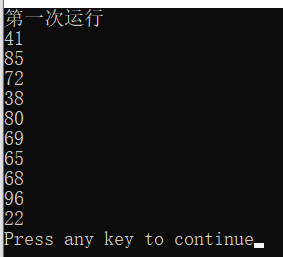
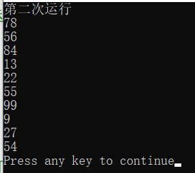

学习笔记：C语言调用随机数

<!-- more -->

## 了解随机函数rand()

C语言有自己的随机函数rand()，使用随机函数需要的头文件为[<stdlib.h>](https://baike.baidu.com/item/stdlib.h/10370777?fr=aladdin)。调用了rand()即可生成0-RAND_MAX之间的随机数，关于rand()说明可参考[该文章](https://www.cnblogs.com/guihailiuli/p/4154416.html)。     

rand()函数可生成一个伪随机数，这个数范围是0-RAND_MAX。根据rand函数定义：int rand(void),此时RAND_MAX的范围至少在32767之间（int），即双字节（16位），倘若用的是unsigned int定义，那么是65535。据此也知道利用rand函数生成的数是整型数据。（按了解是这样）

rand()函数生成的是假随机数，即每次执行时得到的结果是相同的，若要不同那需要以不同的值来初始化，初始化的函数就是srand()。

## 控制范围

在实际应用时，我们通常需要得到一定范围内的随机数。那么这是可以利用取余的原理来执行。

取余原理：对任意两个整数x和y，它们在整数的[除法](https://baike.baidu.com/item/除法/6280598)中，只有能整除与不能整除两种情况。不能整除则得到余数，对于`x%y`,得到的**余数的范围是[0，y-1]**。根据数学知识，倘若要得到[x，y]范围的余数，那么可以先获取[0，y-x]范围的余数，此时表达式应为`x%(y-x+1)`；再求[x，y]范围的余数，表达式应为`x%(y-x+1)+x`。

那么将这原理应用于rand函数，无论使用它生成了[0，RAND_MAX]的哪个随机数，只要表达式为`rand()%(y-x+1)+x`，那么即可得到范围为[x，y]内的一个随机数。举个例子，令x=0,y=100,则表达式为`rand()%101`，此时计算机则提供给你一个范围在[0，100]内的随机整数。

值得注意的是，C语言提供的[rand函数](https://baike.baidu.com/item/rand()/3002042?fromtitle=rand函数&fromid=5916603&fr=aladdin)是伪随机数，如果不做其它处理，那么每次运行程序获取到的随机数序列是固定的。为了解决这个问题，C语言还定义了srand()这个库函数，用来设定一个随机数种子，从而得到一个不确定的随机初始值。

## 获取真随机数

若仅仅使用上述方法，我们无法让每次运行程序得到的随机数不一样。这个时候我们需要srand()函数，这个函数需要的头文件同样为<stdlib.h>，它的定义： void srand(unsigned int seed)，功能：srand()用来设置rand()产生随机数时的随机数种子，参数seed必须是整数，通常可以用time(0)的返回值作为seed.如果每次seed都设置相同的值，rand()产生的随机数值每次都一样。

[srand()](https://baike.baidu.com/item/srand/796881?fr=aladdin)函数要求有一个int型的参数，这个参数比较常见的做法是用time(NULL)来获取当前微秒数来充当。于是一个完整的设定随机数种子的操作为`srand(time(NULL))`,其中[time函数](https://www.baidu.com/s?wd=time函数&tn=SE_PcZhidaonwhc_ngpagmjz&rsv_dl=gh_pc_zhidao)需要引入[<time.h>](https://baike.baidu.com/item/time.h/4429250?fr=aladdin)来声明。且srand()需要在第一次调用rand前调用。

## 实际操作

单纯只用rand()函数：

```c
//抽取10个值在[0,100]范围内的随机数程序可以写成
#include<stdio.h>
#include<stdlib.h>
int main()
{
    int i;
    for(i = 0; i < 10; i ++)
        printf("%d\n", rand()%101);//这里增加了模除运算，由于最小值就是0，所以不需要加法了。
    return 0;
}
```

两次运行结果分别为：




---

同时使用rand()和srand()函数:

```c
获取[0,100]间10个随机整数
#include<stdio.h>
#include <stdlib.h>
#include <time.h> //增加time函数的头文件
int main()
{
    int i;    
    srand(time(NULL));//设置随机数种子，只需要调用一次即可,且需在第一次调用rand()前调用。     
    for(i = 0; i < 10; i ++)
        printf("%d\n", rand()%101);         
    return 0;
}
```

两次运行结果分别为：




---

参考文章：

[百度问答](https://zhidao.baidu.com/question/1174510994098432459.html)

[有关rand()，srand()产生随机数学习总结](https://www.cnblogs.com/guihailiuli/p/4154416.html)
